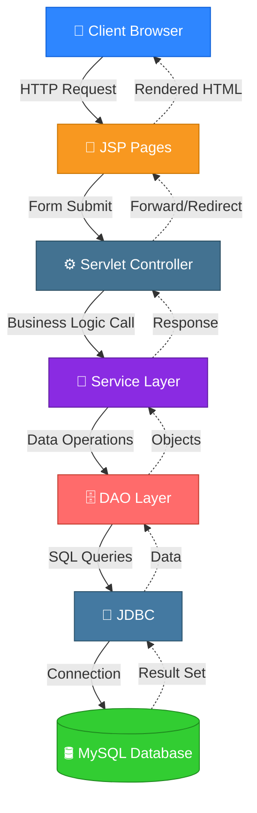

<div align="center">


<br/>


# 🚀 WorkPort — Freelancer Marketplace Platform

### *Connecting Clients & Freelancers. Seamlessly. Securely. Smartly.*

<br/>

<!-- Typing SVG -->
<a href="https://git.io/typing-svg">
  
</a>

<br/><br/>

<!-- Badges -->


<br/>


<br/><br/>

<a href="#-installation">🛠 Installation</a> •
<a href="#-features">✨ Features</a> •
<a href="#-screenshots">🖼 Screenshots</a> •
<a href="#-project-architecture">🏗 Architecture</a> •
<a href="#-contributing">🤝 Contributing</a> •
<a href="#-support">⭐ Support</a>

</div>

<br/>

---

## 📖 About Project

<div align="center">

</div>

**WorkPort** is a robust, full-stack **Freelancer Marketplace Platform** engineered using core **Java (JSP + Servlets + JDBC)** technologies, designed to replicate the essential experience of platforms like **Upwork** and **Freelancer.com**. 🌐

🎯 It bridges the gap between **Clients** who need work done and **Freelancers** who deliver quality — through a secure, feature-rich ecosystem that includes:

- 💼 Job posting & intelligent bidding system
- 💬 Real-time-style messaging between clients & freelancers
- 💰 Secure in-app wallet & transaction management
- 🔔 Smart notification system
- ⭐ Ratings & reviews for trust-building
- 📊 Insightful dashboard analytics for every user role
- 🛡️ Dedicated Admin panel for platform governance

> Built with a **clean layered architecture** (Servlet → Service → DAO → JDBC), WorkPort demonstrates enterprise-grade Java web development practices — perfect for learning, portfolio showcase, or as a foundation for a production SaaS product. 💡

<br/>

## ✨ Features

<div align="center">

### 👤 Client Features

</div>

| # | Feature | Description |
|---|---------|-------------|
| 1️⃣ | 📝 **Registration** | Quick and secure client sign-up |
| 2️⃣ | 🔐 **Login** | Authenticated session-based access |
| 3️⃣ | 📊 **Dashboard** | Overview of jobs, spend & activity |
| 4️⃣ | 📢 **Post Jobs** | Create detailed job listings with budget & scope |
| 5️⃣ | ⚙️ **Manage Jobs** | Edit, close, or track posted jobs |
| 6️⃣ | 🤝 **Hire Freelancer** | Review bids and hire the best talent |
| 7️⃣ | 💰 **Wallet** | Add funds and manage balance |
| 8️⃣ | 🔔 **Notifications** | Real-time alerts on bids, messages & hires |
| 9️⃣ | 💬 **Messaging** | Direct chat with freelancers |
| 🔟 | ⭐ **Reviews** | Leave feedback after project completion |
| 1️⃣1️⃣ | 🌟 **Ratings** | Rate freelancer performance |
| 1️⃣2️⃣ | 🔒 **Secure Payments** | Escrow-style protected transactions |
| 1️⃣3️⃣ | ✅ **Profile Completion** | Guided profile setup progress |
| 1️⃣4️⃣ | 🔍 **Search Freelancer** | Filter freelancers by skill & rating |

<div align="center">

### 💻 Freelancer Features

</div>

| # | Feature | Description |
|---|---------|-------------|
| 1️⃣ | 📝 **Registration** | Simple onboarding for freelancers |
| 2️⃣ | 🔐 **Login** | Secure authenticated access |
| 3️⃣ | 🔎 **Browse Jobs** | Explore jobs by category & budget |
| 4️⃣ | 🎯 **Apply/Bid** | Submit competitive proposals |
| 5️⃣ | 🖼️ **Portfolio** | Showcase past work & skills |
| 6️⃣ | 💰 **Wallet** | Track earnings & balance |
| 7️⃣ | 🔔 **Notifications** | Stay updated on bid status |
| 8️⃣ | 💬 **Messaging** | Chat directly with clients |
| 9️⃣ | ✅ **Profile Completion** | Build a trustworthy profile |
| 🔟 | 📈 **Earnings** | Track income over time |
| 1️⃣1️⃣ | 🌟 **Ratings** | Build reputation through ratings |
| 1️⃣2️⃣ | ⭐ **Reviews** | Receive client feedback |
| 1️⃣3️⃣ | 🏧 **Withdraw Balance** | Cash out earnings securely |
| 1️⃣4️⃣ | 📊 **Dashboard** | Full activity & performance overview |

<br/>

## 🛡️ Admin Features

<div align="center">

| 🔧 Feature | 📋 Description |
|:---:|:---|
| 👥 **User Management** | Manage clients & freelancers, suspend/activate accounts |
| 📁 **Job Management** | Monitor, moderate & remove job listings |
| 💳 **Wallet Management** | Oversee transactions, deposits & withdrawals |
| 📑 **Reports** | Generate platform activity reports |
| 📈 **Analytics** | Visualize platform growth & engagement metrics |
| 🖥️ **Platform Monitoring** | Real-time health & activity monitoring |

</div>

<br/>


> 📌 *Replace the placeholder images above with actual screenshots stored in a `/screenshots` folder for the best presentation.*

<br/>

## 🧰 Tech Stack

<div align="center">


</div>

<br/>

## 🏗 Project Architecture

WorkPort follows a **clean, layered MVC-style architecture** ensuring separation of concerns, maintainability, and scalability.



<br/>

## 🗄️ Database

WorkPort uses **MySQL** as its relational database, structured around core entities such as `Users`, `Clients`, `Freelancers`, `Jobs`, `Bids`, `Wallets`, `Transactions`, `Messages`, `Notifications`, and `Reviews`.

<div align="center">

</div>

> 📌 *Replace this placeholder with your actual ER Diagram (e.g., exported from MySQL Workbench).*

<details>
<summary><b>📋 Click to view Core Table Overview</b></summary>

| Table | Purpose |
|-------|---------|
| `users` | Stores base user credentials & role (client/freelancer/admin) |
| `clients` | Client-specific profile data |
| `freelancers` | Freelancer-specific profile & skill data |
| `jobs` | Job postings created by clients |
| `bids` | Freelancer proposals against jobs |
| `wallets` | Wallet balance per user |
| `transactions` | Deposit, withdrawal & payment records |
| `messages` | Chat messages between users |
| `notifications` | System-generated alerts |
| `reviews` | Ratings & feedback post-project |

</details>

<br/>

## 📂 Folder Structure

```
WorkPort/
│
├── 📁 src/
│   ├── 📁 main/
│   │   ├── 📁 java/
│   │   │   └── 📁 com/workport/
│   │   │       ├── 📁 controller/        # Servlet Controllers
│   │   │       │   ├── LoginServlet.java
│   │   │       │   ├── JobServlet.java
│   │   │       │   ├── BidServlet.java
│   │   │       │   └── WalletServlet.java
│   │   │       │
│   │   │       ├── 📁 service/           # Business Logic Layer
│   │   │       │   ├── UserService.java
│   │   │       │   ├── JobService.java
│   │   │       │   └── WalletService.java
│   │   │       │
│   │   │       ├── 📁 dao/               # Data Access Layer
│   │   │       │   ├── UserDAO.java
│   │   │       │   ├── JobDAO.java
│   │   │       │   └── WalletDAO.java
│   │   │       │
│   │   │       ├── 📁 model/             # POJO / Entity Classes
│   │   │       │   ├── User.java
│   │   │       │   ├── Job.java
│   │   │       │   └── Bid.java
│   │   │       │
│   │   │       └── 📁 util/              # DB Connection & Helpers
│   │   │           └── DBConnection.java
│   │   │
│   │   └── 📁 webapp/
│   │       ├── 📁 pages/                 # JSP Views
│   │       │   ├── home.jsp
│   │       │   ├── login.jsp
│   │       │   ├── signup.jsp
│   │       │   ├── dashboard.jsp
│   │       │   ├── postJob.jsp
│   │       │   └── wallet.jsp
│   │       │
│   │       ├── 📁 assets/
│   │       │   ├── 📁 css/
│   │       │   ├── 📁 js/
│   │       │   └── 📁 images/
│   │       │
│   │       └── 📄 WEB-INF/web.xml
│   │
│   └── 📁 test/                          # Unit Tests
│
├── 📁 database/
│   └── 📄 workport_schema.sql            # MySQL Database Script
│
├── 📁 screenshots/                       # UI Screenshots
│
├── 📄 .gitignore
├── 📄 LICENSE
└── 📄 README.md
```

<br/>


## 🎮 Usage

<table>
<tr>
<td width="50%" valign="top">

### 👔 As a Client
1. Register/Login to your account 🔐
2. Complete your profile ✅
3. Post a new job with budget & requirements 📢
4. Review incoming bids from freelancers 📋
5. Hire your preferred freelancer 🤝
6. Fund your wallet & make secure payments 💰
7. Chat with freelancer during project 💬
8. Rate & review after completion ⭐

</td>
<td width="50%" valign="top">

### 💻 As a Freelancer
1. Register/Login to your account 🔐
2. Build your profile & portfolio 🖼️
3. Browse available jobs 🔍
4. Submit competitive bids 🎯
5. Get hired & start working 🚀
6. Communicate via built-in messaging 💬
7. Track earnings in your wallet 📈
8. Withdraw balance & receive reviews 🏧

</td>
</tr>
</table>

<br/>

## 🔄 Workflow

```mermaid
flowchart LR
    A[📢 Client Posts Job] --> B[🎯 Freelancer Applies/Bids]
    B --> C[✅ Client Accepts Bid]
    C --> D[🚀 Project Starts]
    D --> E[💰 Payment via Wallet]
    E --> F[⭐ Review & Rating]

    style A fill:#2E86FF,stroke:#0B5ED7,color:#fff
    style B fill:#F89820,stroke:#C97400,color:#fff
    style C fill:#32CD32,stroke:#1F8B1F,color:#fff
    style D fill:#8A2BE2,stroke:#5E1A9E,color:#fff
    style E fill:#FFD700,stroke:#C9A600,color:#000
    style F fill:#FF6B6B,stroke:#C0392B,color:#fff
```



<br/>

## 🔮 Future Enhancements

<div align="center">

| Feature | Status |
|---------|:---:|
| 🤖 AI Job Recommendation | 🔜 Planned |
| 🧠 AI Resume Matching | 🔜 Planned |
| 🎥 Video Meetings Integration | 🔜 Planned |
| 📱 Mobile App (Android/iOS) | 🔜 Planned |
| 🌙 Dark Mode | 🔜 Planned |
| 📧 Email Verification | 🔜 Planned |
| 🔑 OTP Login | 🔜 Planned |
| 💳 Razorpay Payment Integration | 🔜 Planned |
| 💬 Real-time Chat (WebSocket) | 🔜 Planned |
| 🔐 JWT Authentication | 🔜 Planned |

</div>

<br/>

## 🤝 Contributing

Contributions make the open-source community an incredible place to learn, inspire, and create! Any contributions you make are **greatly appreciated**. 🙌

<details>
<summary><b>📋 How to Contribute</b></summary>

<br/>

1. 🍴 **Fork** the repository
2. 🌿 **Create your Feature Branch**
   ```bash
   git checkout -b feature/AmazingFeature
   ```
3. 💾 **Commit your Changes**
   ```bash
   git commit -m "Add: AmazingFeature"
   ```
4. 📤 **Push to the Branch**
   ```bash
   git push origin feature/AmazingFeature
   ```
5. 🔃 **Open a Pull Request**

</details>

### 📜 Contribution Guidelines

- Follow existing code style & naming conventions
- Write clear, descriptive commit messages
- Test your changes before submitting a PR
- Update documentation where relevant
- Be respectful and constructive in discussions

<br/>

## 📄 License

This project is licensed under the **MIT License**.

```
MIT License © 2025 Prem Yadav
Permission is hereby granted, free of charge, to any person obtaining a copy
of this software and associated documentation files to deal in the Software
without restriction, subject to the conditions of the MIT License.
```

See the [LICENSE](./LICENSE) file for full details.

<br/>

## 👨‍💻 Author

<div align="center">

### **Prem Yadav**

Full-Stack Java Developer | Building Real-World Web Applications 💻

[](https://github.com/yprem1225)
[](https://github.com/yprem1225/Freelancer)
[](https://www.linkedin.com/in/your-linkedin-placeholder)
[](mailto:your-email-placeholder@example.com)

</div>

<br/>

## 📊 GitHub Stats

<div align="center">


<br/>


</div>

<br/>

## ⭐ Support

<div align="center">

If you find **WorkPort** useful or inspiring, please consider giving it a ⭐!

It motivates continued development and helps others discover the project. 🙏

[](https://github.com/yprem1225/Freelancer)

</div>

<br/>

---

<div align="center">

### 💬 *"Great platforms are built by great communities."*

<br/>

**Made with ❤️ and ☕ by [Prem Yadav](https://github.com/yprem1225)**

<br/>


</div>
